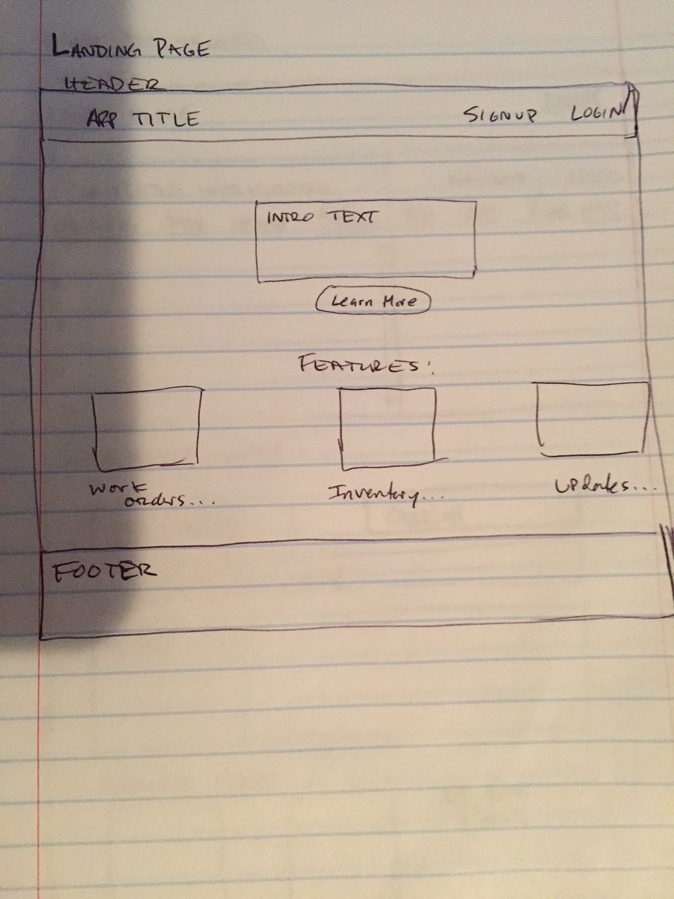

# keeptrack-react-capstone

## Project Description
This website is a basic tool for small businesses operating in the repair services industry.  The website is a repair order generator and basic inventory management system.  A user will be able to create an order, adding a summary of parts used for each repaired item on the order.  By adding parts to the order, once saved, it will decrease the current inventory stock.

<!--### [*** Live Preview - Community Water***](https://community-water.herokuapp.com/)-->

## User Stories
* As a visitor I want to visit the website's landing page and learn what it's about
* As a visitor I want to be able to register/login so that I can access the app
* As a registered user I want to create a new repair order so I can log my repair work
* As a registered user on a work order creation page, I want to add a new item repaired so that I can include all parts used
* As a registered user I want to print a saved work order, so that I can have a formatted template for the customer
* As a registered user I want to view the workorder dashboard so that I can see all completed work orders.
* As a registered user I want to view the inventory list so I know what the current stock is for each part
* As a registered user I want to click on an inventory item so that I can get detailed info on the item
* As a registered user I want to view the metrics report so I know our team's work progress (daily and weekly totals)

## Screenshots

## Wire Frames

## Technical
* Front-End: HTML5 | CSS3 | JavaScript ES6 | React | Redux
* Back-End: Node.js | Express.js | Mocha | Chai | RESTful API Endpoints | MongoDB | Mongoose

## Development Roadmap
This is v1.0 of the app, with basic RESTful features, but future enhancements are expected to include:
*
*

