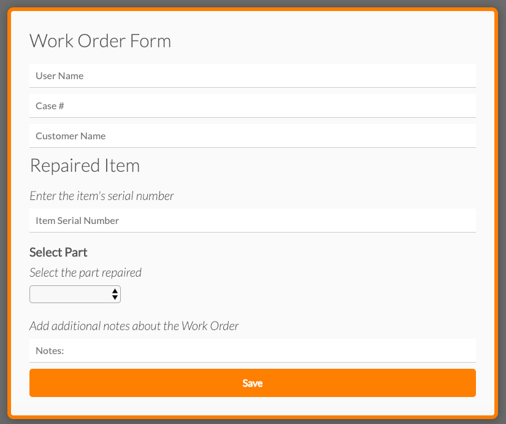
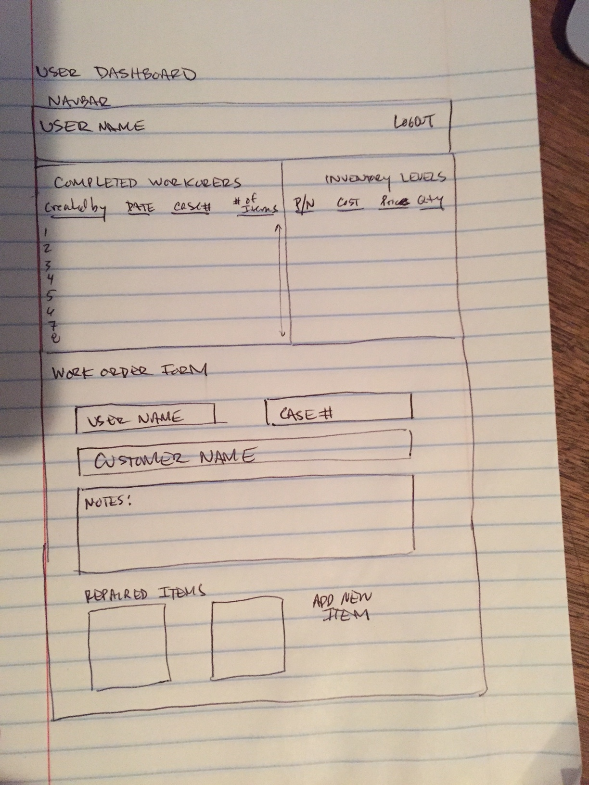

# keeptrack-react-capstone

## Project Description
This website is a basic tool for small businesses operating in the repair services industry.  The website is a repair order generator and basic inventory management system.  A user will be able to create a workorder, adding a summary of parts used for each repaired item on the order.  By adding parts to the order, once saved, it will decrease the current inventory stock.

### [*** Live Preview - keepTrack***](https://keeptrack-react-capstone.herokuapp.com/)

## User Stories
* As a visitor I want to visit the website's landing page and learn what it's about
* As a visitor I want to be able to register/login so that I can access the app
* As a registered user I want to create a new repair order so I can log my repair work
* As a registered user on a work order creation form, I want enter repair information so that I can submit the work order.
* As a registered user I want to view the workorder dashboard so that I can see all completed work orders
* As a registered user I want to view the inventory list so I know what the current stock is for each part

## Screenshots
Landing Page  | Features
:-------------------------:|:-------------------------:
|

Login Form | Signup Form
:-------------------------:|:-------------------------:
|

Inventory Report | Workorder Report
:-------------------------:|:-------------------------:
|

Workorder Steps | Workorder Form
:-------------------------:|:-------------------------:
|

## Wire Frames

## Technical
* Front-End: HTML5 | CSS3 | JavaScript ES6 | React | Redux
* Back-End: Node.js | Express.js | Mocha | Chai | RESTful API Endpoints | MongoDB | Mongoose

## Development Roadmap
This is v1.0 of the app, with basic RESTful features, but future enhancements are expected to include:
* Registered users can add more than one Repaired Item and Repaired Parts
* Registered users can print completed work orders, so they can provide a formatted template to the customer.
* Registered users can update inventory counts
* Registered users can click on an inventory item in the inventory list to get a detailed view of the item (picture, description, cost, price).
* Registered users can view a metrics report on the dashboard.  This will show completed workorders by week, month, and quarter

